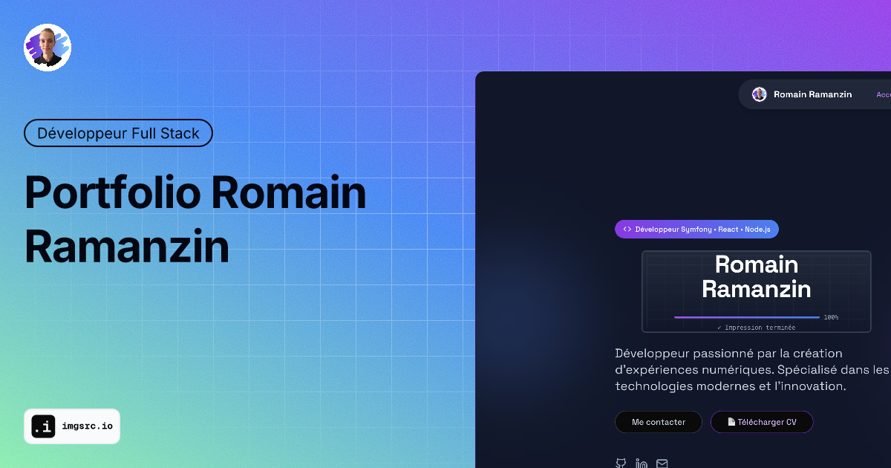

# Portfolio - Romain Ramanzin



Un portfolio moderne et responsive développé avec Next.js, présentant mes compétences, expériences et projets en tant que développeur web fullstack.

## 🌐 Aperçu

**URL en ligne :** [https://romainramanzin.fr](https://romainramanzin.fr)

Ce portfolio présente :

- Mes compétences techniques et projets
- Mon expérience professionnelle et formation
- Mes certifications
- Mes recommandations clients
- Mes informations de contact

## 🚀 Technologies utilisées

- **Framework :** Next.js 15 (App Router)
- **Langage :** TypeScript
- **Styling :** Tailwind CSS
- **UI Components :** Shadcn/ui
- **Icônes :** Lucide React
- **Polices :** Space Grotesk (Google Fonts)
- **Déploiement :** Vercel

## 📦 Installation

### Prérequis

- Node.js 18+
- npm, yarn, pnpm ou bun

### Étapes d'installation

1. **Cloner le repository**

```bash
git clone https://github.com/RomainRamanzin/portfolio.git
cd portfolio
```

2. **Installer les dépendances**

```bash
npm install
# ou
yarn install
# ou
pnpm install
```

3. **Lancer le serveur de développement**

```bash
npm run dev
# ou
yarn dev
# ou
pnpm dev
```

4. **Ouvrir dans le navigateur**
   Accédez à [http://localhost:3000](http://localhost:3000)

## 🛠️ Scripts disponibles

```bash
# Développement
npm run dev

# Build de production
npm run build

# Lancement en mode production
npm run start

# Vérification du code (ESLint)
npm run lint
```

## 📁 Structure du projet

```
portfolio/
├── app/                    # App Router de Next.js
│   ├── layout.tsx         # Layout principal avec métadonnées
│   ├── page.tsx           # Page d'accueil
│   ├── sitemap.xml        # Sitemap pour SEO
│   └── robots.txt         # Instructions pour les crawlers
├── components/            # Composants React
│   ├── ui/               # Composants UI (Shadcn)
│   ├── Header.tsx        # Navigation principale
│   ├── Footer.tsx        # Pied de page
│   ├── Hero.tsx          # Section héro
│   ├── Projects.tsx      # Projets
│   ├── Experience.tsx    # Expérience professionnelle
│   ├── Education.tsx     # Formation
│   ├── Certifications.tsx # Certifications
│   ├── Recommandations.tsx # Recommandations
│   └── Contact.tsx       # Contact
├── public/               # Fichiers statiques
│   ├── images/          # Images du portfolio
│   ├── logo/            # Logos et icônes
│   └── favicon.ico      # Favicon
├── lib/                 # Utilitaires
└── styles/             # Styles globaux
```

## 🎨 Fonctionnalités

- ✅ **Design responsive** - Compatible mobile, tablette et desktop
- ✅ **Optimisé SEO** - Métadonnées complètes, sitemap, robots.txt
- ✅ **Performance optimisée** - Images optimisées, lazy loading
- ✅ **Animations fluides** - Transitions CSS et scroll smooth

## 📊 SEO et Métadonnées

Le site inclut :

- Métadonnées Open Graph pour les réseaux sociaux
- Twitter Cards pour un meilleur partage
- Structured data (JSON-LD)
- Sitemap XML automatique
- Robots.txt optimisé

## 🚀 Déploiement

### Déploiement avec Vercel

- Connectez votre repository à Vercel : importez le projet depuis votre compte GitHub sur vercel.com → New Project → Import.
- Déploiements automatiques : les pushes sur la branche principale et les PRs déclenchent des déploiements (production & previews).

### Hébergement personnalisé

1. Exécutez `npm run build`
2. Uploadez le contenu du dossier `out/` sur votre serveur

## 🔧 Configuration

### Variables d'environnement

Créez un fichier `.env.local` pour les configurations spécifiques :

```env
NEXT_PUBLIC_SITE_URL=https://romainramanzin.fr
```

### Personnalisation

- Modifiez les données dans chaque composant
- Adaptez les couleurs dans `tailwind.config.ts`
- Remplacez les images dans `public/images/`

## 📄 Licence

Ce projet est sous licence MIT.

## 📞 Contact

**Romain Ramanzin**

- Portfolio : [https://romainramanzin.fr](https://romainramanzin.fr)
- Email : romain.ramanzin@gmail.com
- LinkedIn : [linkedin.com/in/romainrr](https://linkedin.com/in/romainrr)
- GitHub : [github.com/RomainRamanzin](https://github.com/RomainRamanzin)

---

_Développé avec ❤️ par Romain Ramanzin_
